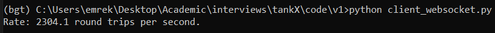
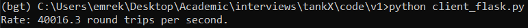
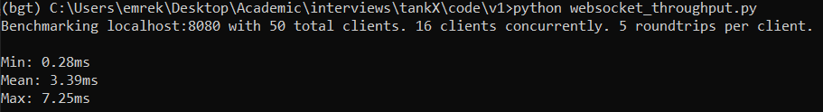
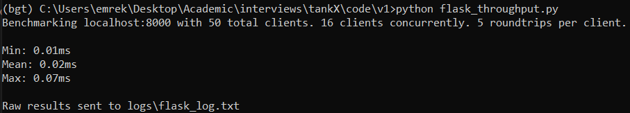

<h1 style="text-align: center;"> Benchmarking of Different Server-Client Frameworks</h1>

This repository benchmarks Websockets and Flask-SocketIO frameworks in terms of data rate and throughput.

# Roundtrips Per Second

## Websockets

`websocket_server.py` and `client_websocket.py` makes use of `websockets` module to transmit/receive the data.

We transmit and receive the string 'hi' for 5 seconds and measure the average number of round trip transmissions. In order to re-generate the results:

1. Open a terminal
2. Run `python websocket_server.py`
3. Open another terminal
4. Run `python client_websocket.py`

The result should give approximately 2300 round trip transactions.

## Flask - SocketIO

`flask_io.py` and `client_flask.py` make use of `Flask SocketIO` module to transmit/receive the data.

In order to have a fair comparison, we transmit and receive the same string 'hi' for the same duration, 5, seconds and measure the average number of round trip transmissions. In order to re-generate the results:

1. Open a terminal
2. Run `python flask_io.py`
3. Open another terminal
4. Run `python client_flask.py`

The result should give approximately 40000 round trip transactions.

This is a much better result than the previous approach.

# Throughput

The scripts `websocket_throughput.py` and `flask_throughput.py` creates multiple clients connected to the server and measures their min, mean and max throughput. The results are as follows:

As can be seen, Flask-SocketIO framework does a much better job when compared to Websockets.

# Connection Time

It is observed that the initial connection time for a client to server is much larger in Flask-SocketIO when compared to Websockets. However, for a real-time application operating continuously, the initial connection time is not relevant unless the application needs to disconnect and re-connect to the server in a regular basis.

# Configurations

* CPU: Intel(R) Core(TM) i7-10750H CPU @ 2.60GHz, 2.59 GHz
* RAM: 16 GB
* OS: Windows 10
* Num. of cores utilized: 1
* Num. of threads utilized: 1